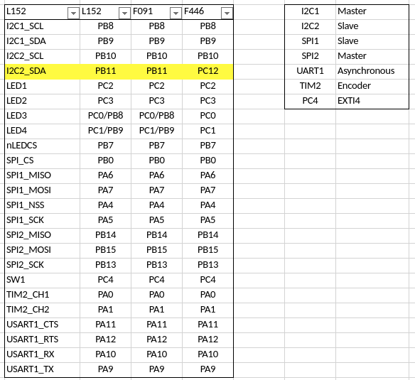

# Akashi-02
A test Jig for Murasaki-Library. Tested with audio codec board UMB-AD1361A.

## Functionality
This board is designed to test the audio interface functionality of the STM32 series MCU. The connectors can be directly mounted on the Nucleo 144 series board. With this board, the following audio interface can be tested :
- SAI peripheral (STM32F722, F746, H743)
- Simplex I2S peripheral (STM32F722, F746)
- Duplex I2S peripheral (STM32H743)

These functionalities are tested with following codec board as with I2C control line. 
- [UMB-ADAU1361A](http://dsps.shop-pro.jp/?pid=82798273)

## Development
- [KiCad 5.1](http://kicad-pcb.org/blog/2019/03/KiCad-5.1.0-Release/)
- [Nucleo F722ZE](https://www.st.com/en/evaluation-tools/nucleo-f722ze.html)
- [Nucleo F746ZG](https://www.st.com/ja/evaluation-tools/nucleo-f746zg.html)
- [Nucleo H743ZI](https://www.st.com/ja/evaluation-tools/nucleo-h743zi.html)

The schematics [can be donwloaded](docs/Akashi-02.pdf) as PDF format. 

## I2C address
By default, the I2C device address are fixed as ***0x38*** ( 7bit address ). If you want to change, you should modify the short bridge J2-J5 as following :
- J2 : Open by cutting the pattern.
- J3 : Close by soldering.
- J4 : Open by cutting the pattern.
- J5 : Close by soldering.

By above modification , the address can be controled by GPIO PB12 and PA15. The address can be determined as following :

| b6 | b5 | b4 | b3 | b2 | b1    | b0   |
-----|----|----|----|----|-------|---- 
| 0  | 1  | 1  | 1  | 0  | PB12  | PA15 |

## Audio Port selection
This board allow to use SAI or I2S ( Both simplex and duplex). By default, ***Only SAI connection*** is allowed. The configuration of the board is as following : 

| Port | JP1     | JP6     | R5        |
-------|---------|---------|-----------
| SAI  | Opened  | Closed  | Removed   |
| I2S  | Closed  | Opened  | Removed   |
| Both | Opened  | Closed  | Installed |

"Both" is not recommended.

## Usage
The test program works with this board is published as [murasaki_test_audio](https://github.com/suikan4github/murasaki_test_audio) project. 

If you develop a software working with this board, that software has to follow the pin configuration below. Note that pin marked as "-" have to be left input state. Otherwise, the board might be broken. 

## License
This PCB design is released under the [Creative Commons Attribution 4.0 International license](https://creativecommons.org/licenses/by/4.0/). You are welcome to use this design for commercial purposes. 